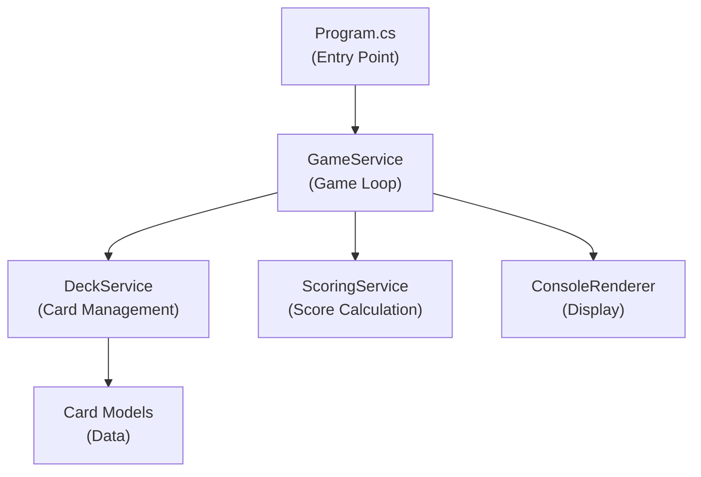
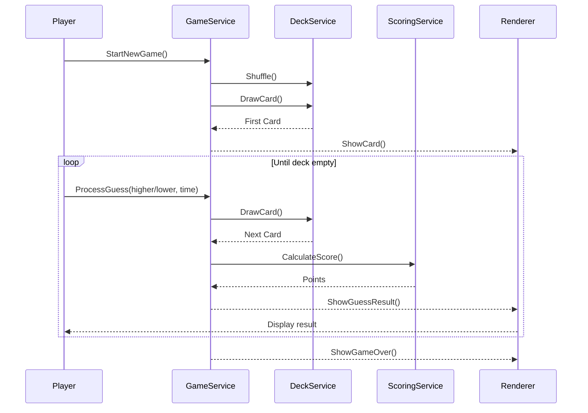

# Implementation Plan Template

Use this template to define HOW the feature will be technically implemented.

**Prerequisites:** Complete Product Requirements document first. This plan translates product requirements into technical design.

---

# Implementation Plan: [Feature Name]

## Overview

**Feature:** [Feature name - link to Product Requirements]  
**Priority:** [High/Medium/Low]  
**Estimated Effort:** [Story points or time estimate]  
**Target Completion:** [Date or sprint]  
**Assigned To:** [Developer/Team]

---

## Technical Summary

**Approach:** [1-2 sentences describing the technical approach]

**Key Technologies:**
- [Technology/framework 1]
- [Technology/framework 2]
- [Library/package 3]

**Example:**
> **Approach:** Implement as a .NET console application with a clean separation between game logic, scoring, and display. Use records for immutable card representation and dependency injection for testability.  
> **Key Technologies:** .NET 8.0, C# 12, xUnit for testing

---

## Architecture & Design

### High-Level Architecture



**Layers:**
1. **Entry Point (Program.cs):** Initialize services, start game loop
2. **Game Logic (GameService):** Manage game state, process guesses
3. **Deck Management (DeckService):** Shuffle, draw cards
4. **Scoring (ScoringService):** Calculate points with time/streak
5. **Display (ConsoleRenderer):** Render cards and UI

---

## Project Structure

```
/HighLow
  /src
    /HighLow
      /Models                  - Domain entities
        Card.cs                - Card record with suit and value
        Suit.cs                - Enum for card suits
        GameState.cs           - Current game state
        GameStatistics.cs      - End-of-game statistics
        GuessResult.cs         - Result of a guess
      /Services                - Business logic
        GameService.cs         - Main game loop
        IGameService.cs        - Game service interface
        DeckService.cs         - Deck shuffling and drawing
        IDeckService.cs        - Deck service interface
        ScoringService.cs      - Score calculation
        IScoringService.cs     - Scoring service interface
      /Display                 - UI rendering
        ConsoleRenderer.cs     - ASCII card display
        IRenderer.cs           - Renderer interface
      Program.cs               - Application entry point
      HighLow.csproj           - Project file
  /tests
    /HighLow.Tests
      /Models
        CardTests.cs           - Test card comparison
      /Services
        DeckServiceTests.cs    - Test shuffle determinism
        ScoringServiceTests.cs - Test scoring formula
        GameServiceTests.cs    - Test game flow
      HighLow.Tests.csproj
  AGENTS.md                    - Project conventions
  PRODUCT-REQUIREMENTS.md      - Product requirements
  IMPLEMENTATION-PLAN.md       - This document
  README.md                    - User documentation
```

---

## Component Design

### 1. Models (Domain Entities)

#### Suit.cs
```csharp
namespace HighLow.Models;

/// <summary>
/// Represents the four suits in a standard deck.
/// </summary>
public enum Suit
{
    Spades,
    Hearts,
    Diamonds,
    Clubs
}
```

#### Card.cs
```csharp
namespace HighLow.Models;

/// <summary>
/// Represents a playing card with suit and value.
/// </summary>
public record Card(Suit Suit, int Value)
{
    /// <summary>
    /// Gets the display string (e.g., "7♠", "K♥").
    /// </summary>
    public string Display => $"{ValueSymbol}{SuitSymbol}";

    /// <summary>
    /// Gets the full name (e.g., "7 of Spades").
    /// </summary>
    public string FullName => $"{ValueName} of {Suit}";

    public string ValueSymbol => Value switch
    {
        1 => "A",
        11 => "J",
        12 => "Q",
        13 => "K",
        _ => Value.ToString()
    };

    public string ValueName => Value switch
    {
        1 => "Ace",
        11 => "Jack",
        12 => "Queen",
        13 => "King",
        _ => Value.ToString()
    };

    public char SuitSymbol => Suit switch
    {
        Suit.Spades => '♠',
        Suit.Hearts => '♥',
        Suit.Diamonds => '♦',
        Suit.Clubs => '♣',
        _ => '?'
    };

    /// <summary>
    /// Compares this card to another. Returns positive if higher, negative if lower, 0 if equal.
    /// </summary>
    public int CompareTo(Card other) => Value.CompareTo(other.Value);
}
```

#### GameState.cs
```csharp
namespace HighLow.Models;

/// <summary>
/// Represents the current state of a game.
/// </summary>
public class GameState
{
    public Card CurrentCard { get; set; } = null!;
    public int CardsRemaining { get; set; }
    public int Score { get; set; }
    public int CurrentStreak { get; set; }
    public int LongestStreak { get; set; }
    public int CorrectGuesses { get; set; }
    public int TotalGuesses { get; set; }
    public int Ties { get; set; }
    public List<double> ResponseTimes { get; } = new();
    public bool IsGameOver { get; set; }
}
```

#### GuessResult.cs
```csharp
namespace HighLow.Models;

/// <summary>
/// Result of a player's guess.
/// </summary>
public record GuessResult(
    bool IsCorrect,
    bool IsTie,
    Card PreviousCard,
    Card NewCard,
    int PointsEarned,
    int SpeedBonus,
    double StreakMultiplier,
    double ElapsedSeconds
);
```

**Design Decisions:**
- Use `record` for immutable `Card` (value semantics)
- Use `class` for mutable `GameState` (changes during game)
- Card values: Ace=1, Jack=11, Queen=12, King=13
- Comparison is strictly numeric

---

### 2. Deck Service

#### IDeckService.cs
```csharp
namespace HighLow.Services;

/// <summary>
/// Manages deck creation and card drawing.
/// </summary>
public interface IDeckService
{
    void Shuffle(int? seed = null);
    Card DrawCard();
    int CardsRemaining { get; }
    bool HasCards { get; }
}
```

#### DeckService.cs
**Responsibilities:**
- Create standard 52-card deck
- Shuffle using Fisher-Yates algorithm
- Draw cards sequentially
- Support seeded random for testing

**Key Implementation Details:**
```csharp
public class DeckService : IDeckService
{
    private readonly List<Card> _deck = new();
    private int _currentIndex;
    private Random _random;

    public DeckService(int? seed = null)
    {
        _random = seed.HasValue ? new Random(seed.Value) : new Random();
        InitializeDeck();
    }

    private void InitializeDeck()
    {
        _deck.Clear();
        foreach (Suit suit in Enum.GetValues<Suit>())
        {
            for (int value = 1; value <= 13; value++)
            {
                _deck.Add(new Card(suit, value));
            }
        }
    }

    public void Shuffle(int? seed = null)
    {
        if (seed.HasValue)
            _random = new Random(seed.Value);
        
        // Fisher-Yates shuffle
        for (int i = _deck.Count - 1; i > 0; i--)
        {
            int j = _random.Next(i + 1);
            (_deck[i], _deck[j]) = (_deck[j], _deck[i]);
        }
        _currentIndex = 0;
    }

    public Card DrawCard() => _deck[_currentIndex++];
    public int CardsRemaining => _deck.Count - _currentIndex;
    public bool HasCards => _currentIndex < _deck.Count;
}
```

---

### 3. Scoring Service

#### IScoringService.cs
```csharp
namespace HighLow.Services;

public interface IScoringService
{
    int CalculateScore(bool isCorrect, double elapsedSeconds, int currentStreak);
    (int basePoints, int speedBonus, double multiplier) GetScoreBreakdown(
        bool isCorrect, double elapsedSeconds, int currentStreak);
}
```

#### ScoringService.cs
**Scoring Formula:**
```
base_points = 10
speed_bonus = max(0, 5 - floor(elapsed_seconds - 3))  // 5 if < 3s, decreases after
streak_multiplier = 1.0 + (current_streak × 0.5)
total = floor((base_points + speed_bonus) × streak_multiplier)
```

**Implementation:**
```csharp
public class ScoringService : IScoringService
{
    private const int BasePoints = 10;
    private const int MaxSpeedBonus = 5;
    private const double SpeedBonusThreshold = 3.0;
    private const double StreakMultiplierIncrement = 0.5;

    public int CalculateScore(bool isCorrect, double elapsedSeconds, int currentStreak)
    {
        if (!isCorrect) return 0;

        var (basePoints, speedBonus, multiplier) = GetScoreBreakdown(isCorrect, elapsedSeconds, currentStreak);
        return (int)Math.Floor((basePoints + speedBonus) * multiplier);
    }

    public (int basePoints, int speedBonus, double multiplier) GetScoreBreakdown(
        bool isCorrect, double elapsedSeconds, int currentStreak)
    {
        if (!isCorrect) return (0, 0, 0);

        var speedBonus = elapsedSeconds <= SpeedBonusThreshold 
            ? MaxSpeedBonus 
            : Math.Max(0, MaxSpeedBonus - (int)(elapsedSeconds - SpeedBonusThreshold));
        
        var multiplier = 1.0 + (currentStreak * StreakMultiplierIncrement);

        return (BasePoints, speedBonus, multiplier);
    }
}
```

---

### 4. Game Service

#### IGameService.cs
```csharp
namespace HighLow.Services;

public interface IGameService
{
    GameState StartNewGame(int? seed = null);
    GuessResult ProcessGuess(bool guessedHigher, double elapsedSeconds);
    GameStatistics GetFinalStatistics();
}
```

#### GameService.cs
**Responsibilities:**
- Initialize new game with shuffled deck
- Process player guesses
- Update game state (score, streak, statistics)
- Determine game over condition

**Key Flow:**
1. `StartNewGame()`: Shuffle deck, draw first card, initialize state
2. `ProcessGuess()`: Compare cards, calculate score, update state, draw next card
3. `GetFinalStatistics()`: Calculate and return end-game stats

---

### 5. Console Renderer

#### IRenderer.cs
```csharp
namespace HighLow.Display;

public interface IRenderer
{
    void ShowWelcomeScreen();
    void ShowCard(Card card, GameState state);
    void ShowGuessResult(GuessResult result, GameState state);
    void ShowGameOver(GameStatistics stats);
    void ShowError(string message);
    char GetPlayerInput();
}
```

#### ConsoleRenderer.cs
**Responsibilities:**
- Render ASCII art cards
- Display game status (score, streak, cards remaining)
- Show guess results with animations
- Handle terminal output formatting

**Card Display Format:**
```
┌─────────┐
│ 7       │
│         │
│    ♠    │
│         │
│       7 │
└─────────┘
```

**Implementation Notes:**
- Use Console.Clear() for clean screen updates
- Support both cards side-by-side for result display
- Use colors if terminal supports (red for hearts/diamonds)
- Fire emoji (🔥) for streaks ≥ 3

---

## Data Flow

### Game Loop Sequence



---

## Error Handling Strategy

### Input Validation
- Invalid key: Show error message, don't count as guess, reprompt
- Ctrl+C: Catch, show current stats, exit gracefully

### Exception Handling
```csharp
// In Program.cs
Console.CancelKeyPress += (sender, e) =>
{
    e.Cancel = true;
    var stats = gameService.GetFinalStatistics();
    renderer.ShowGameOver(stats);
    Environment.Exit(0);
};
```

### Error Messages
- Clear, actionable messages
- Don't crash on any user input
- Log unexpected errors (optional)

---

## Testing Strategy

### Unit Tests

**Coverage Target:** 80% minimum

#### CardTests.cs
```csharp
[Theory]
[InlineData(1, "A")]
[InlineData(10, "10")]
[InlineData(11, "J")]
[InlineData(12, "Q")]
[InlineData(13, "K")]
public void ValueSymbol_ReturnsCorrectSymbol(int value, string expected)
{
    var card = new Card(Suit.Spades, value);
    Assert.Equal(expected, card.ValueSymbol);
}

[Fact]
public void CompareTo_HigherCard_ReturnsPositive()
{
    var lower = new Card(Suit.Hearts, 5);
    var higher = new Card(Suit.Clubs, 10);
    Assert.True(higher.CompareTo(lower) > 0);
}
```

#### ScoringServiceTests.cs
```csharp
[Theory]
[InlineData(true, 2.0, 0, 15)]   // Fast, no streak
[InlineData(true, 5.0, 0, 10)]   // Slow, no streak
[InlineData(true, 2.0, 3, 37)]   // Fast, streak 3
[InlineData(false, 1.0, 5, 0)]   // Wrong guess
public void CalculateScore_VariousScenarios(
    bool isCorrect, double seconds, int streak, int expected)
{
    var service = new ScoringService();
    Assert.Equal(expected, service.CalculateScore(isCorrect, seconds, streak));
}
```

#### DeckServiceTests.cs
```csharp
[Fact]
public void Shuffle_WithSameSeed_ProducesSameOrder()
{
    var deck1 = new DeckService(42);
    var deck2 = new DeckService(42);
    deck1.Shuffle(42);
    deck2.Shuffle(42);

    for (int i = 0; i < 52; i++)
    {
        Assert.Equal(deck1.DrawCard(), deck2.DrawCard());
    }
}

[Fact]
public void DrawCard_UntilEmpty_Returns52Cards()
{
    var deck = new DeckService();
    deck.Shuffle();
    
    var cards = new List<Card>();
    while (deck.HasCards)
    {
        cards.Add(deck.DrawCard());
    }
    
    Assert.Equal(52, cards.Count);
    Assert.Equal(52, cards.Distinct().Count()); // All unique
}
```

---

## Implementation Phases

### Phase 1: Models & Basic Services (1-2 hours)
- [ ] Create Card, Suit, GameState models
- [ ] Implement DeckService with shuffle
- [ ] Implement ScoringService with formula
- [ ] Write unit tests for all above

**Deliverable:** Core logic working, all tests pass

### Phase 2: Game Service (1 hour)
- [ ] Implement GameService with game loop logic
- [ ] Track state (score, streak, statistics)
- [ ] Handle ties correctly
- [ ] Write integration tests

**Deliverable:** Can simulate a complete game programmatically

### Phase 3: Console Display (1-2 hours)
- [ ] Implement ConsoleRenderer
- [ ] Create ASCII card art
- [ ] Display game state, results, game over
- [ ] Handle user input

**Deliverable:** Playable game in terminal

### Phase 4: Polish & Edge Cases (30 min)
- [ ] Ctrl+C handling
- [ ] Invalid input handling
- [ ] Perfect game message
- [ ] Play again flow

**Deliverable:** Production-ready game

---

## Dependencies & Libraries

### NuGet Packages

| Package | Version | Purpose |
|---------|---------|---------|
| xUnit | >= 2.6.0 | Unit testing |
| xUnit.runner.visualstudio | >= 2.6.0 | Test runner |
| Microsoft.NET.Test.Sdk | >= 17.8.0 | Test infrastructure |

### No External Runtime Dependencies
This project intentionally uses only .NET built-in libraries.

---

## Performance Considerations

### Expected Performance

| Operation | Target | Notes |
|-----------|--------|-------|
| Startup | < 100ms | Minimal initialization |
| Shuffle | < 1ms | 52 cards, in-memory |
| Draw card | < 1μs | Array index lookup |
| Score calculation | < 1μs | Simple math |
| Render card | < 10ms | Console output |

No optimization needed for this simple game.

---

## Definition of Done

Feature is complete when:

- [ ] All code follows AGENTS.md conventions
- [ ] All unit tests pass with >= 80% coverage
- [ ] All acceptance criteria verified
- [ ] Works on Windows, macOS, Linux
- [ ] README.md has clear instructions
- [ ] Ctrl+C exits gracefully
- [ ] No crashes on any input
- [ ] Code reviewed

---

## Notes for Implementation

**Before starting:**
1. Review Product Requirements document
2. Review AGENTS.md conventions
3. Set up .NET 8.0 project structure

**During implementation:**
1. Write tests first (TDD)
2. Start with models and scoring (easy to test)
3. Add game service next
4. Add display last (hardest to test)

**Key reminders:**
- Aces are always low (value 1)
- Ties: 0 points, streak continues
- Speed bonus starts decreasing after 3 seconds
- Use seeded Random for deterministic tests
