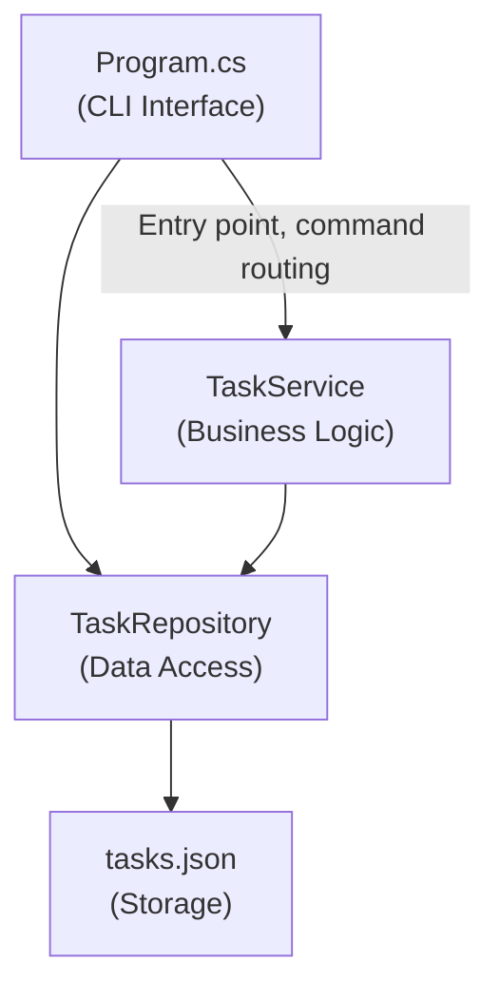
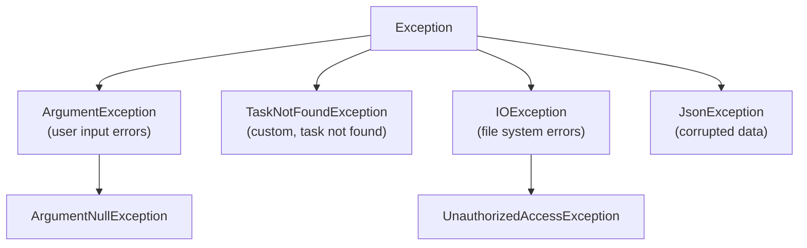

# Implementation Plan Template

Use this template to define HOW the feature will be technically implemented.

**Prerequisites:** Complete Product Requirements document first. This plan translates product requirements into technical design.

---

# Implementation Plan: [Feature Name]

## Overview

**Feature:** [Feature name - link to Product Requirements]  
**Priority:** [High/Medium/Low]  
**Estimated Effort:** [Story points or time estimate]  
**Target Completion:** [Date or sprint]  
**Assigned To:** [Developer/Team]

---

## Technical Summary

**Approach:** [1-2 sentences describing the technical approach]

**Key Technologies:**
- [Technology/framework 1]
- [Technology/framework 2]
- [Library/package 3]

**Example:**
> **Approach:** Implement as a .NET console application using System.CommandLine for argument parsing and System.Text.Json for data persistence.  
> **Key Technologies:** .NET 8.0, System.CommandLine 2.0, System.Text.Json

---

## Architecture & Design

### High-Level Architecture



**Layers:**
1. **Presentation (CLI):** Command parsing and output formatting
2. **Business Logic:** Task operations and validation
3. **Data Access:** Persistence and retrieval
4. **Storage:** JSON file in user's home directory

---

## Project Structure

```
/MyTaskManager
  /src
    /MyTaskManager
      /Models              - Domain entities
        Task.cs            - Task model with properties
        TaskStatus.cs      - Enum for task status
      /Services            - Business logic
        TaskService.cs     - Core task operations
        ITaskService.cs    - Service interface
      /Storage             - Data persistence
        TaskRepository.cs  - JSON file operations
        ITaskRepository.cs - Repository interface
      /Commands            - CLI command handlers
        AddCommand.cs      - Handler for 'add' command
        ListCommand.cs     - Handler for 'list' command
        CompleteCommand.cs - Handler for 'complete' command
        DeleteCommand.cs   - Handler for 'delete' command
      /Utilities           - Helper classes
        PathHelper.cs      - Cross-platform path resolution
      Program.cs           - Application entry point
      MyTaskManager.csproj - Project file
  /tests
    /MyTaskManager.Tests
      /Models
        TaskTests.cs
      /Services
        TaskServiceTests.cs
      /Storage
        TaskRepositoryTests.cs
      MyTaskManager.Tests.csproj
  AGENTS.md                - Project conventions
  PRODUCT-REQUIREMENTS.md  - Product requirements
  IMPLEMENTATION-PLAN.md   - This document
  README.md                - User documentation
```

---

## Component Design

### 1. Models (Domain Entities)

#### Task.cs
```csharp
namespace MyTaskManager.Models;

/// <summary>
/// Represents a task in the system.
/// </summary>
public class Task
{
    /// <summary>
    /// Gets the unique identifier for the task.
    /// </summary>
    public Guid Id { get; init; } = Guid.NewGuid();

    /// <summary>
    /// Gets the task title.
    /// </summary>
    public required string Title { get; init; }

    /// <summary>
    /// Gets the optional task description.
    /// </summary>
    public string? Description { get; init; }

    /// <summary>
    /// Gets or sets the task status.
    /// </summary>
    public TaskStatus Status { get; set; } = TaskStatus.Pending;

    /// <summary>
    /// Gets the creation timestamp (UTC).
    /// </summary>
    public DateTime CreatedAt { get; init; } = DateTime.UtcNow;
}
```

#### TaskStatus.cs
```csharp
namespace MyTaskManager.Models;

/// <summary>
/// Represents the status of a task.
/// </summary>
public enum TaskStatus
{
    Pending,
    Complete
}
```

**Design Decisions:**
- Use `Guid` for unique IDs (no collision risk)
- Use `required` keyword for mandatory properties (C# 11+)
- Use `init` for immutable properties where appropriate
- Store timestamps in UTC for consistency
- Status is mutable (can change from Pending to Complete)

---

### 2. Data Access Layer

#### ITaskRepository.cs (Interface)
```csharp
namespace MyTaskManager.Storage;

/// <summary>
/// Defines operations for task persistence.
/// </summary>
public interface ITaskRepository
{
    /// <summary>
    /// Loads all tasks from storage.
    /// </summary>
    Task<IReadOnlyList<Models.Task>> LoadTasksAsync();

    /// <summary>
    /// Saves all tasks to storage.
    /// </summary>
    Task SaveTasksAsync(IEnumerable<Models.Task> tasks);
}
```

#### TaskRepository.cs (Implementation)
**Responsibilities:**
- Read/write JSON file at `~/.taskmanager/tasks.json`
- Handle file creation on first run
- Use atomic writes to prevent corruption
- Handle errors gracefully (permissions, disk full, etc.)

**Key Implementation Details:**
- Use `System.Text.Json` for serialization
- Use `JsonSerializerOptions` with:
  - `WriteIndented = true` (human-readable)
  - `PropertyNamingPolicy = JsonNamingPolicy.CamelCase`
- Use `File.WriteAllTextAsync` with temp file + rename for atomicity
- Create directory if it doesn't exist
- Handle JSON deserialization errors (corrupted file)

**Error Handling:**
- `IOException`: Permission denied, disk full
- `JsonException`: Corrupted JSON
- `UnauthorizedAccessException`: No write permissions

---

### 3. Business Logic Layer

#### ITaskService.cs (Interface)
```csharp
namespace MyTaskManager.Services;

/// <summary>
/// Defines operations for task management.
/// </summary>
public interface ITaskService
{
    Task<Models.Task> AddTaskAsync(string title, string? description = null);
    Task<IReadOnlyList<Models.Task>> GetAllTasksAsync();
    Task<IReadOnlyList<Models.Task>> GetTasksByStatusAsync(TaskStatus status);
    Task<Models.Task?> GetTaskByIdAsync(string taskId);
    Task CompleteTaskAsync(string taskId);
    Task DeleteTaskAsync(string taskId);
}
```

#### TaskService.cs (Implementation)
**Responsibilities:**
- Validate inputs (non-empty title, length limits)
- Create new tasks with generated IDs
- Load/filter tasks
- Update task status
- Delete tasks
- Coordinate with repository for persistence

**Key Implementation Details:**
- Validate title: trim whitespace, check not empty, check length < 200
- Support partial IDs: match first N characters of GUID
- Handle ambiguous partial IDs (error if multiple matches)
- Always persist changes immediately after modification
- Throw specific exceptions for different error cases:
  - `ArgumentException`: Invalid input
  - `TaskNotFoundException`: Task not found
  - `InvalidOperationException`: Invalid state (e.g., already complete)

**Validation Rules:**
```csharp
private void ValidateTitle(string title)
{
    if (string.IsNullOrWhiteSpace(title))
        throw new ArgumentException("Task title cannot be empty", nameof(title));
    
    if (title.Length > 200)
        throw new ArgumentException("Task title cannot exceed 200 characters", nameof(title));
}
```

---

### 4. Presentation Layer (CLI)

#### Program.cs
**Responsibilities:**
- Parse command-line arguments using System.CommandLine
- Route to appropriate command handlers
- Handle top-level errors
- Display help when no args provided

**Structure:**
```csharp
var rootCommand = new RootCommand("Task Manager CLI");

var addCommand = new Command("add", "Add a new task");
addCommand.AddArgument(new Argument<string>("title"));
addCommand.AddOption(new Option<string?>("--description"));
addCommand.SetHandler(AddCommand.HandleAsync, ...);

var listCommand = new Command("list", "List all tasks");
listCommand.AddOption(new Option<TaskStatus?>("--status"));
listCommand.SetHandler(ListCommand.HandleAsync, ...);

// ... other commands

rootCommand.AddCommand(addCommand);
rootCommand.AddCommand(listCommand);
// ... add other commands

return await rootCommand.InvokeAsync(args);
```

#### Command Handlers

Each command handler:
1. Extract arguments/options from command line
2. Validate inputs (basic validation, service does detailed)
3. Call service methods
4. Format output for console
5. Handle errors and display user-friendly messages
6. Return appropriate exit code (0 = success, 1 = user error, 2 = system error)

**Example: AddCommand.cs**
```csharp
public static class AddCommand
{
    public static async Task<int> HandleAsync(
        string title,
        string? description,
        ITaskService taskService)
    {
        try
        {
            var task = await taskService.AddTaskAsync(title, description);
            
            Console.WriteLine("Task added successfully!");
            Console.WriteLine($"ID: {task.Id.ToString()[..8]}");
            Console.WriteLine($"Title: {task.Title}");
            Console.WriteLine($"Status: {task.Status}");
            
            return 0; // Success
        }
        catch (ArgumentException ex)
        {
            Console.WriteLine($"Error: {ex.Message}");
            return 1; // User error
        }
        catch (IOException ex)
        {
            Console.WriteLine($"Error: Failed to save task. {ex.Message}");
            return 2; // System error
        }
    }
}
```

**Output Formatting:**
- Use fixed-width columns for table display
- Pad/truncate to fit terminal width
- Use clear separators (dashes, pipes)
- Show only first 8 chars of GUID for readability

---

## Data Model & Storage

### JSON File Format

**Location:** `~/.taskmanager/tasks.json`

**Format:**
```json
{
  "tasks": [
    {
      "id": "a3f2d4e1-b5c7-4a9f-8d6e-2f1a3c4b5d6e",
      "title": "Buy groceries",
      "description": "Milk, eggs, bread",
      "status": "Pending",
      "createdAt": "2025-12-07T10:30:00Z"
    },
    {
      "id": "b5c7a3f2-c1d8-4e9a-7f6b-3c2d1a4e5b6f",
      "title": "Write report",
      "description": null,
      "status": "Complete",
      "createdAt": "2025-12-06T15:45:00Z"
    }
  ]
}
```

**Serialization Configuration:**
```csharp
var options = new JsonSerializerOptions
{
    WriteIndented = true,  // Human-readable
    PropertyNamingPolicy = JsonNamingPolicy.CamelCase,  // camelCase in JSON
    DefaultIgnoreCondition = JsonIgnoreCondition.Never,  // Include nulls
    Converters = { new JsonStringEnumConverter() }  // Enums as strings
};
```

### Atomic Write Strategy

To prevent corruption on crash/disk full:

```csharp
1. Serialize to JSON string in memory
2. Write to temporary file: tasks.json.tmp
3. Flush to disk
4. Rename tasks.json.tmp → tasks.json (atomic operation)
5. Delete old file if rename created backup
```

**Code pattern:**
```csharp
var tempFile = Path.Combine(directory, "tasks.json.tmp");
var targetFile = Path.Combine(directory, "tasks.json");

await File.WriteAllTextAsync(tempFile, json);
File.Move(tempFile, targetFile, overwrite: true);  // Atomic on POSIX
```

---

## Error Handling Strategy

### Error Categories

| Category | HTTP Equivalent | Exit Code | Examples |
|----------|----------------|-----------|----------|
| User Input Error | 400 Bad Request | 1 | Empty title, invalid ID |
| Not Found | 404 Not Found | 1 | Task doesn't exist |
| System Error | 500 Server Error | 2 | Permission denied, disk full |

### Exception Hierarchy



### Error Messages

**Principles:**
- Be specific about what went wrong
- Tell user what they can do to fix it
- Don't expose internal details (stack traces, file paths in production)

**Examples:**
```
❌ Bad: "Error"
✅ Good: "Task title cannot be empty"

❌ Bad: "Failed to save"
✅ Good: "Failed to save task. Check write permissions for ~/.taskmanager/"

❌ Bad: "Invalid input"
✅ Good: "Task not found: abc123. Use 'taskmanager list' to see valid IDs"
```

### Error Handling in Each Layer

**Service Layer:**
- Throw specific exceptions with clear messages
- Don't catch exceptions (let them bubble up)

**Repository Layer:**
- Wrap file I/O exceptions with context
- Transform `JsonException` into user-friendly message

**Command Handlers:**
- Catch exceptions at top level
- Display user-friendly error messages
- Return appropriate exit codes
- Log errors for debugging

---

## Dependencies & Libraries

### NuGet Packages

| Package | Version | Purpose |
|---------|---------|---------|
| System.CommandLine | >= 2.0.0 | CLI argument parsing |
| System.Text.Json | (built-in) | JSON serialization |
| xUnit | >= 2.6.0 | Unit testing framework |
| Moq | >= 4.20.0 | Mocking for tests |

### Installation Commands

```bash
# Main project
dotnet add package System.CommandLine

# Test project
cd tests/MyTaskManager.Tests
dotnet add package xUnit
dotnet add package Moq
dotnet add package Microsoft.NET.Test.Sdk
```

### Framework Requirements

- **.NET SDK:** 8.0 or later
- **C# Language:** 12 (for required keyword, file-scoped namespaces)
- **Target Platforms:** Windows, macOS, Linux

---

## Implementation Phases

### Phase 1: Foundation (Day 1)
**Goal:** Basic project structure and models

- [ ] Create solution and project files
- [ ] Set up folder structure
- [ ] Create `Task` and `TaskStatus` models
- [ ] Create `AGENTS.md` with conventions
- [ ] Set up test project
- [ ] Write unit tests for models

**Deliverable:** Compiling project with models

---

### Phase 2: Data Layer (Day 1-2)
**Goal:** Persistence working

- [ ] Implement `ITaskRepository` interface
- [ ] Implement `TaskRepository` with JSON file operations
- [ ] Handle file creation and directory setup
- [ ] Implement atomic write strategy
- [ ] Write unit tests for repository (use temp files)
- [ ] Test error cases (permissions, corrupted JSON)

**Deliverable:** Can save and load tasks from JSON

---

### Phase 3: Business Logic (Day 2)
**Goal:** Core task operations

- [ ] Implement `ITaskService` interface
- [ ] Implement `TaskService`
  - [ ] AddTaskAsync with validation
  - [ ] GetAllTasksAsync
  - [ ] GetTasksByStatusAsync
  - [ ] GetTaskByIdAsync (support partial IDs)
  - [ ] CompleteTaskAsync
  - [ ] DeleteTaskAsync
- [ ] Write comprehensive unit tests
- [ ] Mock repository in tests

**Deliverable:** Task operations working with in-memory data

---

### Phase 4: CLI Interface (Day 3)
**Goal:** User-facing commands

- [ ] Set up System.CommandLine in Program.cs
- [ ] Implement `add` command handler
- [ ] Implement `list` command handler
- [ ] Implement `complete` command handler
- [ ] Implement `delete` command handler
- [ ] Format output (tables, colors if desired)
- [ ] Display help text
- [ ] Handle errors at CLI level

**Deliverable:** Working CLI application

---

### Phase 5: Integration & Testing (Day 3-4)
**Goal:** End-to-end functionality

- [ ] Wire up dependency injection (or manual instantiation)
- [ ] Integration tests for full workflows
- [ ] Test on all platforms (Windows, macOS, Linux)
- [ ] Test edge cases from product requirements
- [ ] Performance testing (10K tasks)
- [ ] Fix bugs found in testing

**Deliverable:** Tested, working application

---

### Phase 6: Documentation & Polish (Day 4)
**Goal:** Ready for use

- [ ] Write README.md with installation and usage
- [ ] Add XML documentation comments
- [ ] Create user examples and demos
- [ ] Package for distribution (if needed)
- [ ] Final code review
- [ ] Update AGENTS.md if patterns changed

**Deliverable:** Shippable product

---

## Testing Strategy

### Unit Tests

**Coverage Target:** 80% minimum

**Test Organization:**
```
/tests/MyTaskManager.Tests
  /Models
    TaskTests.cs          - Test Task model properties and behavior
  /Services
    TaskServiceTests.cs   - Test business logic with mocked repository
  /Storage
    TaskRepositoryTests.cs - Test JSON persistence (use temp files)
```

**Naming Convention:**
```csharp
[Method]_[Scenario]_[ExpectedResult]

Examples:
AddTask_WithValidData_ReturnsNewTask()
AddTask_WithEmptyTitle_ThrowsArgumentException()
GetTaskById_WithPartialId_ReturnsMatchingTask()
SaveTasks_WhenDiskFull_ThrowsIOException()
```

**Test Pattern (AAA):**
```csharp
[Fact]
public async Task AddTask_WithValidData_ReturnsNewTask()
{
    // Arrange
    var mockRepo = new Mock<ITaskRepository>();
    var service = new TaskService(mockRepo.Object);
    
    // Act
    var result = await service.AddTaskAsync("Test task");
    
    // Assert
    Assert.NotNull(result);
    Assert.Equal("Test task", result.Title);
    Assert.Equal(TaskStatus.Pending, result.Status);
    Assert.NotEqual(Guid.Empty, result.Id);
    mockRepo.Verify(r => r.SaveTasksAsync(It.IsAny<IEnumerable<Task>>()), Times.Once);
}
```

### Integration Tests

Test complete workflows:
- Add task → list → complete → list (verify state changes)
- Add task → restart app → list (verify persistence)
- Error paths (corrupted file, no permissions)

### Manual Testing

**Test Matrix:**

| Platform | .NET Version | Test Result |
|----------|--------------|-------------|
| Windows 11 | 8.0 | ✅ |
| macOS 14 | 8.0 | ✅ |
| Ubuntu 22.04 | 8.0 | ✅ |

**Test Scenarios:**
1. Fresh installation (no storage file)
2. Normal operations (add, list, complete, delete)
3. Partial ID matching
4. Error cases (empty title, invalid ID)
5. Persistence across restarts
6. Large dataset (1000+ tasks)

---

## Performance Considerations

### Expected Performance

| Operation | Time | Notes |
|-----------|------|-------|
| Add task | < 20ms | Including file write |
| List tasks | < 10ms | For 1000 tasks |
| Complete task | < 20ms | Including file write |
| Application startup | < 50ms | Cold start |

### Optimization Strategies

**If performance issues arise:**

1. **Lazy loading:** Load tasks only when needed (not on startup)
2. **Caching:** Keep tasks in memory between operations
3. **Async I/O:** Already using `async`/`await`
4. **Pagination:** For very large lists (10K+ tasks)
5. **Indexing:** Build in-memory ID index for faster lookups

**Not needed for v1.0 (premature optimization).**

---

## Security Considerations

### Data Security
- Store in user's home directory only
- Rely on OS file permissions
- No encryption (not sensitive data)
- No authentication (single-user)

### Input Validation
- **Prevent path traversal:** Don't allow user to specify file paths
- **Prevent injection:** Properly escape in JSON (handled by System.Text.Json)
- **Validate lengths:** Prevent extremely large inputs

### Error Messages
- Don't expose internal paths in production
- Don't include stack traces in user-facing errors
- Log detailed errors separately for debugging

---

## Risks & Mitigation

| Risk | Impact | Mitigation |
|------|--------|------------|
| Data loss on crash | High | Atomic file writes |
| Corrupted JSON file | Medium | Validation on load, clear error message |
| Concurrent access | Medium | Document limitation, consider file locking in v2.0 |
| Performance with large datasets | Low | Test with 10K tasks, optimize if needed |
| Cross-platform path issues | Medium | Use Path.Combine, test on all platforms |
| .NET not installed | High | Clear installation instructions in README |

---

## Open Technical Questions

| # | Question | Options | Decision | Decided By | Date |
|---|----------|---------|----------|------------|------|
| 1 | Use dependency injection? | A) Yes (Microsoft.Extensions.DI) B) No (manual) | Manual (B) - simpler for CLI | Tech Lead | 2025-12-07 |
| 2 | Logging framework? | A) Yes (Serilog) B) No (Console only) | No (B) - keep it simple | Tech Lead | 2025-12-07 |
| 3 | Color output in terminal? | A) Yes (add library) B) No (plain text) | No (B) - defer to v2.0 | Product Owner | 2025-12-07 |
| 4 | Package as single executable? | A) Yes (publish trimmed) B) No (requires .NET) | TBD | Tech Lead | TBD |

---

## Definition of Done

Feature is complete when:

- [ ] All code is written and follows AGENTS.md conventions
- [ ] All unit tests pass with >= 80% coverage
- [ ] All acceptance criteria from Product Requirements are verified
- [ ] Integration tests pass
- [ ] Tested on Windows, macOS, and Linux
- [ ] README.md is written with clear usage instructions
- [ ] XML documentation comments on all public APIs
- [ ] Code reviewed by [reviewer name]
- [ ] No critical or high-priority bugs
- [ ] Performance meets requirements (< 100ms commands)

---

## Related Documents

- **Product Requirements:** `PRODUCT-REQUIREMENTS.md` (what to build)
- **AGENTS.md:** Project coding conventions
- **README.md:** User documentation
- **Test Plan:** (if separate document)

---

## Revision History

| Version | Date | Author | Changes |
|---------|------|--------|---------|
| 0.1 | 2025-12-07 | [Name] | Initial technical design |
| 0.2 | 2025-12-08 | [Name] | Added error handling details |
| 1.0 | 2025-12-09 | [Name] | Approved for implementation |

---

## Notes for Implementation

**Before starting:**
1. Review Product Requirements document thoroughly
2. Review AGENTS.md for coding conventions
3. Set up development environment (.NET 8.0 SDK, IDE)
4. Create feature branch in git

**During implementation:**
1. Follow the phases in order
2. Write tests alongside code (TDD approach)
3. Commit frequently with clear messages
4. Run tests after each change
5. Refer back to this plan when uncertain

**If you encounter issues:**
1. Check if product requirements are clear
2. Update this plan if assumptions change
3. Discuss with team if design needs revision
4. Document any deviations and rationale

**This is a LIVING DOCUMENT:**
Update it as you learn and as design evolves during implementation.
