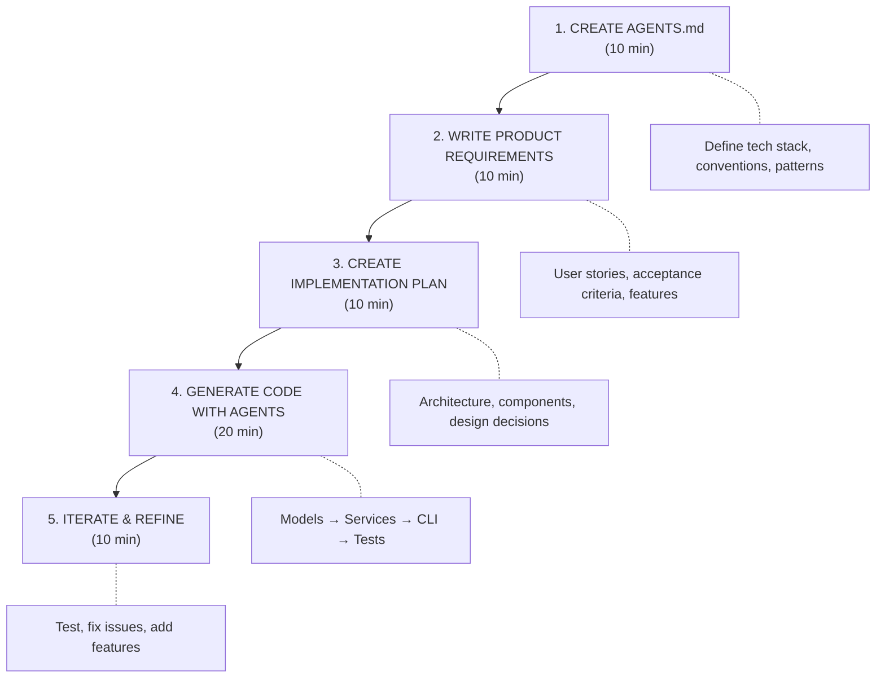
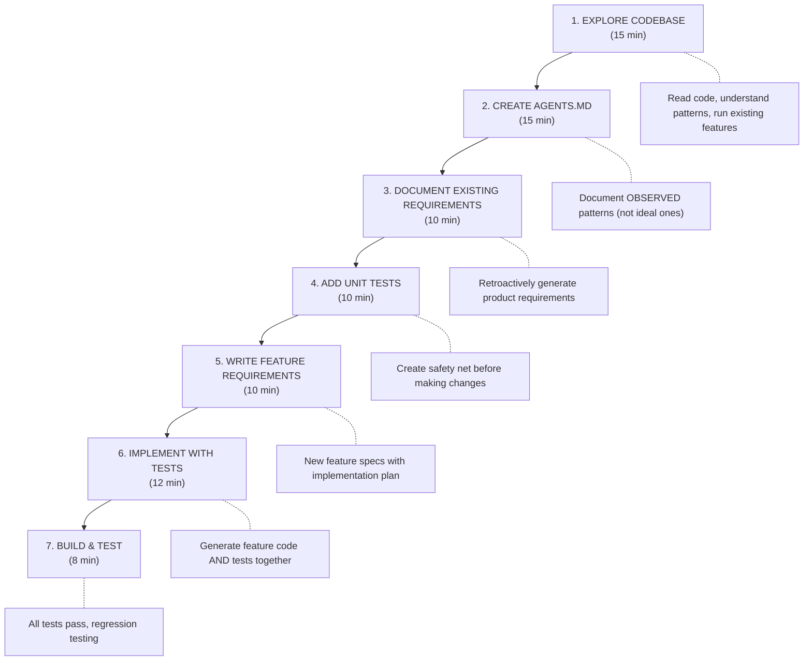

# Agent-Driven Software Development Workshop
## Slide Deck (Markdown Format)

---

# Title Slide

## Agent-Driven Software Development
### Building Software with GitHub Copilot Agent Mode

**Half-Day Workshop**  
Duration: 4 hours

Instructor: Steve Butler  
Date: December 2025

---

# Slide 1: Welcome & Agenda

## What We'll Cover Today

**Module A: Prerequisites & Setup** (30 min)
- Environment verification
- GitHub Copilot Agent Mode intro

**Module B: Greenfield Development** (90 min)
- Requirements-first workflow
- Hands-on lab: Build HighLow Card Game

**Break** (15 min)

**Module C: Brownfield Development** (90 min)
- Working with existing code
- Hands-on lab: Extend Book Library

**Module D: Wrap-Up & Next Steps** (30 min)
- Best practices review
- Q&A and resources

---

# Slide 2: Learning Objectives

## By the end of today, you will:

✅ Set up and use GitHub Copilot Agent Mode effectively

✅ Create AGENTS.md files to guide AI-assisted development

✅ Write effective Product Requirements and Implementation Plans

✅ Build new projects from scratch using agents (greenfield)

✅ Extend existing codebases with AI assistance (brownfield)

✅ Apply best practices for prompt engineering and AI collaboration

✅ Troubleshoot common issues with agent-driven development

**(Optional)** Configure MCP servers for GitHub/Azure DevOps integration

---

# Slide 3: What is Agent Mode?

## GitHub Copilot Agent Mode

**Traditional Copilot:**
- Line-by-line completions
- Suggests code as you type
- Limited context awareness

**Agent Mode:**
- Conversational AI assistant
- Understands entire project context
- Can generate multiple files
- Iterates on requirements
- Reads and modifies existing code and files

**Think of it as:** A pair programmer who never sleeps!

---

# Slide 4: The Challenge

## Software Development is Complex

**Traditional Challenges:**
- Writing boilerplate code
- Maintaining consistency across files
- Understanding unfamiliar codebases
- Translating requirements to code
- Writing tests
- Following team conventions

**AI Can Help With:**
- ✅ Code generation
- ✅ Pattern consistency
- ✅ Code exploration
- ✅ Requirements translation
- ✅ Test automation
- ✅ Convention adherence

---

# Slide 5: Requirements-First Development

## The Core Principle

```
📋 REQUIREMENTS → 🏗️ IMPLEMENTATION PLAN → 💻 CODE
```

**Why this order matters:**

1. **Clarity First:** Know WHAT before HOW
2. **Better AI Results:** Clear requirements = better code
3. **Documentation:** Requirements serve as living docs
4. **Validation:** Easy to verify correctness
5. **Collaboration:** Team alignment on goals

**Anti-Pattern:** 🚫 Jump straight to coding

---

# Slide 6: The Three Essential Documents

## Your AI Development Toolkit

### 1. **AGENTS.md** - The Foundation
*Project conventions and patterns*
- Coding standards
- Architecture decisions
- Naming conventions
- Technology stack

### 2. **Product Requirements** - The WHAT
*What we're building and why*
- User stories
- Acceptance criteria
- Functional requirements
- Success metrics

### 3. **Implementation Plan** - The HOW
*Technical approach*
- Architecture design
- Component breakdown
- Technology choices
- Testing strategy

---

# Slide 7: AGENTS.md - Your AI Guidebook

## What is AGENTS.md?

A markdown file that tells AI assistants about your project's conventions.

**Purpose:**
- Persistent context for AI
- Project "source of truth"
- Reduces repetitive explanations
- Ensures consistency
- **Defines human-reviewable work units**

**Lives in:** Project root directory (`/AGENTS.md`)

**🌟 The Magic:** GitHub Copilot and other AI agents **automatically read** AGENTS.md when it exists!
- No need to reference it in every prompt
- Agent loads it as context automatically
- Works in the background for every interaction

**Contents:**
```markdown
# Project: HighLow Card Game
## Tech Stack
- C# 12, .NET 8.0
- Console-based CLI

## Conventions
- Use file-scoped namespaces
- Records for immutable models (Card)
- Services for game logic

## Work Unit Guidelines
- Max reviewable change: 1 feature or 300 lines
- Break large features into smaller PRs
- Each unit should be testable independently
```

**Think of it as:** Instructions you'd give a new team member

**💡 Pro Tip:** Ask the agent to help you create AGENTS.md!
```
"Help me create an AGENTS.md for a C# .NET 8.0 CLI application.
What sections should I include?"
```

---

# Slide 8: When to Create AGENTS.md

## Greenfield (New Projects)

✅ Create AGENTS.md **FIRST**
- Define conventions upfront
- Guide initial code generation
- Establish patterns from day one
- **Agent auto-loads it for every interaction**

**Example:**
```
1. Create AGENTS.md with tech stack
2. Write requirements
3. Ask agent: "Generate project structure"
   (No need to say "following AGENTS.md" - it's automatic!)
```

## Brownfield (Existing Projects)

✅ Create AGENTS.md after **EXPLORING**
- Observe existing patterns
- Document what's already there
- Note areas of consistency
- **Once created, agent uses it automatically**

**Example:**
```
1. Explore codebase
2. Document observed patterns in AGENTS.md
3. Ask agent to implement features
   (It will follow existing style automatically)
```

**Key Insight:** You don't need to say "follow AGENTS.md" in every prompt.
If `/AGENTS.md` exists, Copilot reads it automatically!

---

# Slide 9: Product Requirements

## Defining the WHAT and WHY

**Focus on:**
- ✅ User needs and goals
- ✅ Functional requirements
- ✅ Acceptance criteria
- ✅ Edge cases and validation
- ✅ Non-functional requirements

**Avoid:**
- 🚫 Implementation details
- 🚫 Technology choices
- 🚫 Code structure
- 🚫 Database schemas

**Example Requirement:**
```markdown
## REQ-001: Card Display
Game displays current card with value and suit symbol.

Acceptance Criteria:
- Card shows value (A, 2-10, J, Q, K)
- Card shows suit symbol (♠ ♥ ♦ ♣)
- Card rendered in ASCII art box
- Display is clear and readable
```

---

# Slide 10: Implementation Plan

## Defining the HOW

**Focus on:**
- ✅ Technical architecture
- ✅ Component design
- ✅ Data models and storage
- ✅ Technology stack
- ✅ Testing approach
- ✅ Error handling strategy
- ✅ **Breaking into prioritizable work units**

**Critical: Think in Features, Not Monoliths**

Don't implement everything at once. Break features into:
- **Reviewable chunks** (1 feature or ~300 lines of code)
- **Independently testable units**
- **Prioritizable work items** (can ship incrementally)
- **Logical phases** (Phase 1: Core, Phase 2: Polish)

**Example:**
```markdown
## Architecture
- Entry Point: Program.cs
- Game Logic: GameService
- Deck Management: DeckService
- Scoring: ScoringService

## Implementation Phases
Phase 1 (High Priority): Cards & Deck
Phase 2 (Medium): Scoring & Streaks  
Phase 3 (Low): Display & Polish

Each phase = 1 reviewable PR

## Error Handling
- Invalid input: reprompt (don't count as guess)
- Ctrl+C: show final score, exit gracefully
```

---

# MODULE A: Prerequisites & Setup

---

# Slide 11: Environment Check

## Let's Verify Your Setup

### Required Tools:

**1. Visual Studio Code**
```bash
code --version
# Should show: 1.85.0 or later
```

**2. .NET SDK**
```bash
dotnet --version
# Should show: 8.0.x
```

**3. GitHub Copilot**
- Open VS Code
- Look for Copilot icon in sidebar
- Should show "Copilot Active"

**4. GitHub EMU Authentication**
- Sign in to GitHub
- Verify enterprise organization access

---

# Slide 12: GitHub Copilot Agent Mode

## Activating Agent Mode

**Method 1: Chat Panel**
1. Open Copilot Chat (Ctrl+Shift+I / Cmd+Shift+I)
2. Type `@workspace` to engage agent mode
3. Ask questions about your project

**Method 2: Inline Chat**
1. Press Ctrl+I (Cmd+I on Mac) in editor
2. Agent has access to current file context

**Method 3: Quick Chat**
1. Press Ctrl+Shift+I (Cmd+Shift+I on Mac)
2. General questions without file context

**Try it now:**
```
@workspace What files are in this workspace?
```

---

# Slide 13: Effective Prompting

## Getting Good Results from Agents

### ✅ Good Prompts:

**1. Ask Questions First:**
```
✅ "What information do you need to create a card game scoring service?"
✅ "What conventions should I document in AGENTS.md for a C# CLI app?"
✅ "What edge cases should I consider for comparing card values?"
```
**Agents can clarify requirements and suggest best practices!**

**2. Be Specific with Details:**
```
❌ "Create a card class"
✅ "Create a Card record with Suit (enum) and Value (int 1-13).
    Include Display property showing '7♠' format.
    Aces are value 1, J=11, Q=12, K=13. Follow AGENTS.md"
```

**3. Provide Context:**
```
❌ "Add error handling"
✅ "Add input validation to the game loop that only accepts 
    H, L, or Q keys. Invalid keys should show an error and 
    reprompt without counting as a guess."
```

**4. Show Examples (Few-Shot Learning):**
```
✅ "Here's how I want the card displayed:
    ┌─────────┐
    │ 7       │
    │    ♠    │
    │       7 │
    └─────────┘
    Now implement the card renderer to match this format."
```

**5. Break Down Complex Tasks:**
```
✅ "Let's implement authentication step by step:
    1. First create the User model
    2. Then create AuthService
    3. Finally add login command"
```

**6. Request Explanations:**
```
✅ "Implement X and explain your approach and any tradeoffs"
```

**Reference Documents:**
```
✅ "Generate ScoringService following the architecture in 
    IMPLEMENTATION-PLAN.md and conventions in AGENTS.md"
```

---

# Slide 14: The AI Development Progression

## Four Levels of AI-Assisted Development

### Level 1: **Single-Shot Prompts** 🎯
*"Create a calculator function"*
- Quick and easy
- Generic results
- No context
- Inconsistent patterns

### Level 2: **Multi-Step Iterations** 🔄
*"Create calculator... now add validation... now add tests"*
- Better refinement
- Still reactive
- Context lost between prompts
- Time-consuming back-and-forth

### Level 3: **Context-Aware Development** 📂
*"Create calculator following AGENTS.md conventions"*
- Consistent patterns
- Project-aware
- Reusable context
- Still ad-hoc requirements

### Level 4: **Spec-First Development** 🏆
*"Implement calculator from REQUIREMENTS.md using AGENTS.md"*
- **Clear requirements**
- **Production-ready code**
- **Complete documentation**
- **Maintainable & testable**

**Today we focus on Level 4**

---

# Slide 15: Demo - The Progression

## Let's See the Difference

**Same Task, Different Approaches:**

### Demo 1: Single-Shot 🎯
```
Prompt: "Create a function to add two numbers"
```
*[Show result: Basic function, no validation, no tests]*

### Demo 2: With Context 📂
```
Prompt: "Create an Add method in Calculator class 
following AGENTS.md conventions"
```
*[Show result: Better structure, follows patterns, still incomplete]*

### Demo 3: Spec-First 🏆
```
Prompt: "Implement Calculator.Add from requirements/calculator.md
following AGENTS.md conventions"
```
*[Show result: Complete with validation, error handling, tests, docs]*

**Key Insight:** Investment in requirements pays off exponentially

---

# Slide 16: Why Spec-First Wins

## The Benefits Are Clear

### Single-Shot Problems:
❌ Ambiguous requirements
❌ Missing edge cases
❌ No validation
❌ Inconsistent patterns
❌ No tests
❌ Poor documentation
❌ Requires extensive revision

### Spec-First Advantages:
✅ **Clarity:** Everyone knows what to build
✅ **Quality:** Edge cases defined upfront
✅ **Consistency:** Patterns documented in AGENTS.md
✅ **Completeness:** Tests and validation included
✅ **Efficiency:** Less back-and-forth
✅ **Maintainability:** Clear documentation
✅ **Collaboration:** Team alignment from start

### Time Investment:
**Single-shot:** 5 min prompt + 2 hours fixing ⇒ **2h 5min**  
**Spec-first:** 20 min requirements + 30 min implementation ⇒ **50 min**

**Spec-first is faster AND better quality!**

---

# Slide 17: When to Use Each Level

## Choosing Your Approach

### 🎯 Level 1: Single-Shot
**Use for:**
- Quick experiments
- Throwaway code
- Learning/exploration
- Trivial utilities

**Example:** *"Generate a random password"*

### 🔄 Level 2: Multi-Step
**Use for:**
- Rapid prototyping
- Unclear requirements
- Exploratory work
- Personal scripts

**Example:** *"Create a scraper... now add error handling..."*

### 📂 Level 3: Context-Aware
**Use for:**
- Extending existing projects
- Small features
- Quick bug fixes
- Team projects (basic)

**Example:** *"Add logout button following AGENTS.md"*

### 🏆 Level 4: Spec-First
**Use for:**
- Production code
- Complex features
- Team collaboration
- Long-term maintenance
- Critical systems

**Example:** *"Implement payment system from requirements/"*

**This workshop focuses on Level 4 for production work**

---

# Slide 18: Common Mistakes to Avoid

## Agent Pitfalls

### ❌ **Mistake 1: No Context**
"Write me a service class"
→ Agent doesn't know your patterns

### ❌ **Mistake 2: Skipping Requirements**
Jump straight to "generate code"
→ Unclear requirements = bad code

### ❌ **Mistake 3: Not Creating AGENTS.md**
Agent reinvents patterns each time
→ Inconsistent code

### ❌ **Mistake 4: Not Asking Questions**
Assume you know everything upfront
→ Miss important considerations

### ❌ **Mistake 5: Accepting First Result**
Use generated code without review
→ Bugs and poor design

### ✅ **Best Practice:**
**ASK QUESTIONS** → Requirements → Plan → AGENTS.md (ask agent to help!) → Iterate with Agent → Review → Test

**Remember:** The agent is your pair programmer - have a conversation!

---

# MODULE B: Greenfield Development

---

# Slide 19: Greenfield Overview

## Building from Scratch

**Greenfield Definition:**
- Starting with empty project
- No existing code constraints
- Define patterns from beginning
- Full creative control

**Advantages with AI:**
- ✅ Establish conventions upfront
- ✅ Consistent code generation
- ✅ Quick scaffolding
- ✅ No legacy patterns to fight

**Today's Lab:**
Build a HighLow Card Game CLI in C# from zero to working code

---

# Slide 20: Greenfield Workflow

## The Process



**Total Time: ~60 minutes**

---

# Slide 21: Demo - Greenfield

## Let's See It In Action

**I'll demonstrate:**

1. Creating AGENTS.md for a simple calculator app
2. Writing quick requirements
3. Asking agent to generate code
4. Running and testing the result

**Watch for:**
- How I phrase prompts
- How I reference AGENTS.md
- How I iterate on results
- How I verify generated code

*[Live Demo: 5 minutes]*

---

# Slide 22: Lab 1 - HighLow Card Game

## Your Turn: Build from Scratch

**Goal:** Create a working HighLow Card Game CLI

**Features to Implement:**
- Display cards with Unicode suit symbols (♠ ♥ ♦ ♣)
- Accept higher/lower guesses
- Calculate score with time and streak bonuses
- Handle ties (zero points, streak continues)
- Show game over statistics

**Time:** 60 minutes

**Resources:**
- `01-greenfield/INSTRUCTIONS.md` - Step-by-step guide
- `01-greenfield/AGENTS-TEMPLATE.md` - Template to copy
- `01-greenfield/PRODUCT-REQUIREMENTS-TEMPLATE.md` - Example structure
- `01-greenfield/IMPLEMENTATION-PLAN-TEMPLATE.md` - Technical guide

**Get started!** 🚀

---

# Slide 23: Lab 1 - Tips

## Success Tips for Greenfield Lab

### Phase 1: AGENTS.md (10 min)
- Copy template and customize for your project
- Specify C# 12 and .NET 8.0
- Define naming conventions
- Note error handling approach

### Phase 2: Requirements (10 min)
- Focus on user needs first
- Write clear acceptance criteria
- Document edge cases
- Don't worry about HOW yet

### Phase 3: Implementation Plan (10 min)
- Draw simple architecture
- Plan folder structure
- Choose System.CommandLine for CLI
- Decide on JSON storage format

### Phase 4: Code Generation (20 min)
- Start with models
- Then services/business logic
- Finally CLI interface
- Ask agent to follow AGENTS.md

### Phase 5: Test & Iterate (10 min)
- Run the app
- Test each command
- Fix issues with agent help
- Add missing validation

---

# Slide 24: Common Greenfield Patterns

## Patterns That Work Well

### Pattern 1: Layer-by-Layer
```
Models → Services → Data Access → Presentation
```
Build from inside out

### Pattern 2: Feature-by-Feature
```
Card Display → Guess Logic → Scoring → Game Loop → Statistics
```
Vertical slices of functionality

### Pattern 3: Test-Driven
```
Requirements → Tests → Implementation
```
Write tests first, generate code to pass them

**For Today's Lab:** Use Layer-by-Layer approach
- Models are foundation
- Services use models
- CLI uses services

---

# BREAK (15 minutes)

---

# MODULE C: Brownfield Development

---

# Slide 25: Brownfield Overview

## Working with Existing Code

**Brownfield Definition:**
- Existing codebase
- Established patterns (good or bad)
- Technical debt
- Must maintain compatibility

**Challenges:**
- Understanding existing code
- Following inconsistent patterns
- Avoiding breaking changes
- Balancing old and new

**AI Advantages:**
- ✅ Quick code exploration
- ✅ Pattern detection
- ✅ Consistent with existing style
- ✅ Test generation for safety

---

# Slide 26: Brownfield Workflow

## The Process (Different from Greenfield!)



**Key Difference:** Document and test existing code BEFORE adding features

---

# Slide 27: Creating AGENTS.md for Existing Code

## Document What EXISTS, Not What You Want

### ✅ Observe and Document:
```markdown
## Observed Patterns
- Services use repository pattern
- Methods are NOT async (legacy design)
- Error handling uses exceptions
- Models in /Models folder
- No dependency injection (manual instantiation)

## Known Issues
- No input validation in CLI layer
- No logging
- Hardcoded file paths

## Areas to Preserve
- Existing API contracts
- File locations
- Command names
```

### ❌ Don't Write Ideal State:
```markdown
## Conventions (WRONG for brownfield)
- All I/O should be async ← Not current state!
- Use dependency injection ← Doesn't exist yet!
```

**Agent needs reality, not aspirations**

---

# Slide 28: Brownfield Best Practices

## Extending Existing Code

### ✅ DO:
- Match existing naming conventions
- Follow established patterns
- Test backward compatibility
- Add features incrementally
- Document deviations in AGENTS.md

### ❌ DON'T:
- Rewrite working code unnecessarily
- Introduce new patterns without team buy-in
- Break existing APIs
- Mix styles (half old, half new in same file)
- Ignore technical debt (but don't fix all at once)

### 🤔 When to Improve:
**Small fixes:** Go ahead (typos, obvious bugs)  
**Pattern changes:** Discuss with team first  
**Major refactors:** Separate ticket/PR

---

# Slide 29: Demo - Brownfield

## Let's Explore Existing Code

**I'll demonstrate:**

1. Exploring the BookLibrary project
2. Creating AGENTS.md from observations
3. Writing requirements for a new feature
4. Asking agent to extend existing code
5. Verifying backward compatibility

**The Project:** Simple book management CLI
- Add books
- List books
- Search books
- Checkout/return books

**New Feature:** Track WHO borrowed each book

*[Live Demo: 5 minutes]*

---

# Slide 30: Lab 2 - Book Library Extension

## Your Turn: Extend Existing Code

**Project:** BookLibrary CLI (in `02-brownfield/BookLibrary/`)

**Current Features:**
- Add books
- List all books
- Search by title/author
- Checkout book (mark as borrowed)
- Return book
- Remove book

**Your Task:** Choose a feature to add:
- Book ratings (1-5 stars)
- Due dates for checkouts
- Book categories/genres
- Export to CSV

**Time:** ~85 minutes

**Resources:**
- `02-brownfield/INSTRUCTIONS.md` - Step-by-step guide
- `02-brownfield/AGENTS-TEMPLATE-BROWNFIELD.md` - Template
- `02-brownfield/BookLibrary/` - Existing project code

---

# Slide 31: Lab 2 - Tips

## Success Tips for Brownfield Lab

### Phase 1: Explore (15 min)
- Run the app: `dotnet run`
- Try all commands
- Read Book.cs model
- Read BookService.cs logic

### Phase 2: Document AGENTS.md (15 min)
- Note existing patterns
- Document conventions observed
- Identify constraints

### Phase 3: Document Existing Requirements (10 min)
- Generate product requirements for current functionality
- Ask questions to reveal edge cases
- Establish baseline documentation

### Phase 4: Add Unit Tests (10 min)
- Create tests for existing functionality
- Establish safety net BEFORE making changes
- Verify tests pass

### Phase 5: Write Feature Requirements (10 min)
- Choose your feature
- Write requirements and implementation plan
- Reference AGENTS.md

### Phase 6: Implement with Tests (12 min)
- Generate code AND tests together
- Follow existing patterns!

### Phase 7: Build & Test (8 min)
- All tests pass (existing + new)
- Manual verification

---

# Slide 32: Handling Technical Debt

## What About Bad Code?

**During Lab (Today):**
- ❌ Don't fix everything
- ✅ Document issues in AGENTS.md
- ✅ Match existing style for now
- ✅ Focus on feature delivery

**In Real Projects:**

**Option 1: Boy Scout Rule**
"Leave code better than you found it"
- Small improvements while adding features
- Fix nearby issues
- Gradual improvement

**Option 2: Separate Refactoring**
- File technical debt tickets
- Prioritize with product owner
- Dedicated refactoring sprints

**Option 3: Document and Move On**
- Note in AGENTS.md: "Known Issue"
- Add TODO comments
- Focus on new value

**Balance:** Ship features vs. improve quality

---

# MODULE D: Wrap-Up & Next Steps

---

# Slide 33: Key Takeaways

## What You've Learned Today

### Core Concepts:
1. **Requirements-First Development**
   - Define WHAT before HOW
   - Clear requirements → better AI results

2. **AGENTS.md is Essential**
   - Persistent context for AI
   - Foundation of consistency
   - Living documentation

3. **Separate Requirements from Plans**
   - Product Requirements = WHAT/WHY
   - Implementation Plan = HOW

4. **Greenfield vs Brownfield**
   - Different workflows
   - Different challenges
   - Same AI tools

### Practical Skills:
✅ Write effective prompts  
✅ Generate code with agents  
✅ Explore existing codebases  
✅ Maintain consistency

---

# Slide 34: Best Practices Recap

## The Golden Rules

### 1. **Always Start with AGENTS.md**
Foundation for everything else

### 2. **Be Specific in Prompts**
"Follow AGENTS.md conventions" → Better results

### 3. **Iterate, Don't Accept First Result**
Review, test, refine

### 4. **Test Generated Code**
AI makes mistakes, verify functionality

### 5. **Update Documentation Immediately**
Answered a question? Clarified a requirement? Update AGENTS.md, requirements, README!

### 6. **Use Requirements-First Workflow**
Requirements → Plan → Code

### 7. **Match Existing Patterns in Brownfield**
Consistency over perfection

**Remember:** Documentation decays the moment you answer a question. Keep it current!

---

# Slide 35: Common Pitfalls

## Learn from These Mistakes

### ❌ **Pitfall 1: No AGENTS.md**
**Problem:** Inconsistent code, repetitive explanations  
**Solution:** Create AGENTS.md first, update regularly

### ❌ **Pitfall 2: Vague Prompts**
**Problem:** "Make it better" → Unhelpful results  
**Solution:** Be specific, provide context, reference docs

### ❌ **Pitfall 3: Blindly Trusting AI**
**Problem:** Generated code has bugs or doesn't fit  
**Solution:** Always review, test, and understand code

### ❌ **Pitfall 4: Fighting Existing Patterns**
**Problem:** Mixing old and new styles in brownfield  
**Solution:** Match existing, document deviations

### ❌ **Pitfall 5: Skipping Requirements**
**Problem:** Code doesn't solve right problem  
**Solution:** Write clear requirements first

---

# Slide 36: Effective Prompt Patterns

## Prompts That Work

### Pattern 1: Role + Context + Task + Constraints
```
"You are a C# expert. In the ScoringService class, add a method 
GetHighScoresAsync that returns the top 10 scores. Follow the 
async patterns in AGENTS.md and use IReadOnlyList return type 
like other methods."
```

### Pattern 2: Chain of Thought
```
"Let's implement user authentication step by step. For each step,
explain your reasoning before writing code:
1. What should the User model contain?
2. How should passwords be stored securely?
3. What validation is needed?"
```

### Pattern 3: Reference + Generate
```
"Generate a GameRepository class following the repository 
pattern described in IMPLEMENTATION-PLAN.md. Use 
System.Text.Json for serialization as specified in AGENTS.md."
```

### Pattern 4: Example + Replicate (Few-Shot)
```
"Add a 'replay' command to Program.cs following the same 
pattern as the 'quit' command. Reset the deck and start a 
new game by calling GameService.StartNewGameAsync."
```

### Pattern 5: Negative Constraints
```
"Implement card display. DO NOT use external libraries. DO NOT 
require Unicode font support. Use ASCII art for card rendering."
```

### Pattern 6: Iterative Refinement
```
First: "Draft a solution for score calculation"
Review output...
Then: "Good, but add streak bonus multiplier"
Review...
Finally: "Add high score persistence"
```

---

# Slide 37: Advanced Prompt Techniques

## Level Up Your Prompting

### Technique 1: Zero-Shot → Few-Shot → Many-Shot

**Zero-Shot** (no examples):
```
"Create error handling for the API"
```

**Few-Shot** (1-2 examples):
```
"Create error handling for the API. Here's how I handle 
validation errors:
try { ValidateInput(); }
catch (ValidationException ex) { return BadRequest(ex.Message); }

Follow this pattern for all error types."
```

**Many-Shot** (multiple examples for complex patterns):
Use when pattern is non-obvious or has many variations

### Technique 2: Constrained Generation
```
"Generate only the method signature, not the implementation"
"Write tests only, I'll implement the code"
"Provide 3 alternative approaches without code"
```

### Technique 3: Self-Critique
```
"Implement game state management. After you're done, critique your 
solution: What edge cases might you have missed? What could 
be more robust?"
```

### Technique 4: Persona/Role Assignment
```
"As a security expert, review this authentication code and 
identify vulnerabilities"

"As a performance engineer, suggest optimizations for this 
data access layer"
```

### Technique 5: Incremental Context
```
Start: "Create a Card model with Suit and Rank"
Add: "Now add comparison methods to the Card model"
Add: "Now create a Deck service that uses this model"
```
Build up complexity gradually

---

# Slide 38: When AI Struggles

### Pattern 4: Problem + Constraints
```
"Fix the null reference exception in GetCardByIndex when the 
deck is empty. Return null instead of throwing, and handle 
this in the CLI by displaying 'No cards remaining'."
```

---

# Slide 39: When AI Struggles

## Knowing the Limits

### Situations Where AI Needs Help:

**Complex Business Logic:**
- Multi-step calculations
- Domain-specific rules
- Edge cases with many conditions
→ *Break into smaller prompts*

**Architecture Decisions:**
- Choosing patterns
- Performance tradeoffs
- Security considerations
→ *Provide decision in prompt*

**Existing Code with Quirks:**
- Unusual patterns
- Legacy constraints
- Non-standard libraries
→ *Document in AGENTS.md*

**Novel Problems:**
- Brand new algorithms
- Cutting-edge features
- Unique requirements
→ *Provide examples or pseudocode*

---

# Slide 40: MCP Servers - Extended Integration (Optional)

## Model Context Protocol (MCP)

**What is MCP?**
Extends Copilot to connect with external systems like GitHub Issues and Azure DevOps.

**Capabilities:**
- 📋 Read/write GitHub Issues
- ✅ Create/update Azure DevOps work items
- 🔗 Link code to requirements automatically
- 📊 Generate traceability reports
- 🤖 Automate task management

**Why Use MCP?**
- Reduce context switching
- Maintain traceability
- Automate project management
- Keep work items in sync with code

**Example:**
```
"Create GitHub issues from requirements/auth.md and label
them as 'feature' in milestone v1.0"

"Update ADO task #12345 to 'In Progress' and add comment
with implementation notes"
```

---

# Slide 41: MCP Workflow Example

## Automated Requirements to Tasks

### Without MCP (Manual):
```
1. Write requirements document
2. Open GitHub/ADO in browser
3. Manually create issues/tasks
4. Copy requirements text
5. Set labels, milestones, assignments
6. Switch back to VS Code
7. Start coding
8. Switch back to update status
9. Link commits manually
```
**Time:** 15-20 minutes overhead per feature

### With MCP (Automated):
```
1. Write requirements document
2. Ask agent: "Create work items from requirements/auth.md"
   → Agent creates all issues/tasks
3. Start coding
4. Agent automatically updates status as you work
5. Agent links commits to work items
```
**Time:** 2-3 minutes overhead per feature

**Savings:** 75% reduction in project management overhead!

---

# Slide 42: MCP Setup Quick Guide

## Getting Started (Optional)

### For GitHub:
```bash
# Install MCP server
code --install-extension github.copilot-mcp-github

# Create Personal Access Token (PAT)
# GitHub → Settings → Developer settings → Tokens
# Scopes: repo, read:org, write:discussion
```

### For Azure DevOps:
```bash
# Install MCP server
npm install -g @microsoft/mcp-server-ado

# Create PAT at dev.azure.com
# Scopes: Work Items (Read, Write)

# Configure in VS Code settings.json
```

### Test It:
```
@workspace Show me all open issues in this repository
@workspace List my assigned ADO tasks
```

**Full instructions:** `00-prerequisites/SETUP.md` section 7

---

# Slide 43: Resources - Cheat Sheet

## Quick Reference Guide

**Essential Files:**
```
AGENTS.md                   - Project conventions
requirements/               - Product requirements folder
  feature-name-requirements.md
  feature-name-implementation.md
```

**Common Prompts:**
```
"Generate [component] following AGENTS.md conventions"
"Implement [feature] as described in requirements/feature.md"
"Add tests for [class] using xUnit"
"Refactor [code] to match patterns in AGENTS.md"
```

**CLI Patterns (C#):**
```bash
dotnet new console -n ProjectName
dotnet add package System.CommandLine
dotnet build
dotnet run -- [args]
dotnet test
```

**Reference:** See `resources/CHEATSHEET.md` in workshop repo

---

# Slide 44: Resources - Best Practices

## Comprehensive Guide

**Full Guide:** `resources/BEST-PRACTICES.md`

**Covers:**
- Requirements-first workflow (detailed)
- AGENTS.md creation and maintenance
- Effective prompting strategies
- Greenfield and brownfield patterns
- Quality checklist for requirements
- Common patterns and anti-patterns
- Troubleshooting guide
- Decision trees for workflows

**Use it as:**
- Reference during development
- Team onboarding material
- Standards documentation

---

# Slide 45: Templates Available

## Starter Templates in Workshop Repo

### AGENTS.md Templates:
- `01-greenfield/AGENTS-TEMPLATE.md` - For new projects
- `02-brownfield/AGENTS-TEMPLATE-BROWNFIELD.md` - For existing code

### Requirements Templates:
- `PRODUCT-REQUIREMENTS-TEMPLATE.md` - Comprehensive example
- `IMPLEMENTATION-PLAN-TEMPLATE.md` - Technical design guide

### Sample Projects:
- `01-greenfield/` - HighLow Card Game (concept)
- `02-brownfield/BookLibrary/` - Working C# CLI app
- `02-brownfield/LegacyInventory/` - Upgrade exercise (.NET modernization)

**Customize for your projects!**

---

# Slide 46: Next Steps - Immediate Actions

## What to Do Monday Morning

### 1. **Pick a Small Feature** (1-2 hours)
Start with something manageable
- Add endpoint to existing API
- Create simple CLI tool
- Build utility function

### 2. **Create AGENTS.md**
Document your project conventions
- Copy template and customize
- Add to git repo
- Share with team

### 3. **Try Requirements-First**
Write requirements before coding
- Use template as guide
- Ask agent to implement
- Compare to manual approach

### 4. **Share Knowledge**
Teach colleagues what you learned
- Demo to team
- Share workshop materials
- Start using in pair programming

---

# Slide 47: Next Steps - Long Term

## Building AI-Assisted Development Culture

### Week 1-2: Personal Practice
- Use agents for daily tasks
- Refine your prompting skills
- Build your AGENTS.md library

### Month 1: Team Adoption
- Share successes with team
- Establish team AGENTS.md standards
- Create shared templates

### Month 2-3: Process Integration
- Update team workflows
- Integrate into code review
- Track productivity gains

### Month 6+: Advanced Patterns
- Complex architecture generation
- Automated testing strategies
- Cross-project consistency

**Goal:** AI as standard tool, like IDE or debugger

---

# Slide 48: Measuring Success

## How to Know It's Working

### Quantitative Metrics:
- ⏱️ Time to implement features (before/after)
- 🐛 Bug rate in generated code
- ✅ Test coverage improvements
- 🔄 Code review cycle time
- 📈 Feature velocity

### Qualitative Indicators:
- 😊 Developer satisfaction
- 🎯 Code consistency across team
- 📚 Documentation quality
- 🧠 Focus on problem-solving vs boilerplate
- 🤝 Knowledge sharing improvements

### Red Flags to Watch:
- ⚠️ Generated code not understood by team
- ⚠️ Over-reliance without review
- ⚠️ Inconsistent patterns emerging
- ⚠️ Technical debt accumulating

---

# Slide 49: Continuing Education

## Keep Learning

### Official Resources:
- **GitHub Copilot Docs:** docs.github.com/copilot
- **VS Code Tips:** code.visualstudio.com/docs/copilot
- **C# Documentation:** docs.microsoft.com/dotnet

### Community:
- GitHub Discussions
- Stack Overflow (`github-copilot` tag)
- Developer blogs and tutorials
- Local developer meetups

### Practice:
- Code challenges with AI assistance
- Open source contributions
- Personal projects
- Experiment with different languages

### Advanced Topics:
- Copilot for testing strategies
- Architecture pattern generation
- Code migration with AI
- Security review with AI

---

# Slide 50: Workshop Feedback

## Help Us Improve

### Quick Survey:

**Rate 1-5:**
1. Overall workshop quality
2. Hands-on lab effectiveness
3. Materials and resources
4. Pace and timing
5. Instructor effectiveness

**Open Questions:**
- What was most valuable?
- What would you change?
- What topics need more coverage?
- Will you use these techniques? Why/why not?

**Survey Link:** [URL or QR Code]

**Your feedback helps future workshops!**

---

# Slide 51: Contact & Support

## Stay Connected

### Workshop Materials:
**GitHub Repository:** [Repository URL]
- All slides and documents
- Sample projects
- Templates
- Resources

### Questions & Support:
**Email:** [instructor@example.com]
**Office Hours:** [Schedule if offering]
**Slack/Teams:** [Channel if available]

### Follow-Up:
- Summary email within 24 hours
- Updated materials within 1 week
- Check-in survey in 1 month

**Thank you for participating!**

---

# Slide 52: Group Discussion

## Share Your Experience

### Discussion Topics:

**What worked well today?**
- Favorite moment or insight
- Biggest "aha!" moment
- Most useful technique

**What was challenging?**
- Struggled with any concepts?
- Technical issues?
- Workflow confusion?

**How will you apply this?**
- Specific use cases at work
- Team adoption plans
- Projects to try

**Questions for the group?**

*[Open floor for discussion]*

---

# Slide 53: Final Thoughts

## The Future of Development

### AI is a Tool, Not a Replacement

**Developers Still Need:**
- 🧠 Problem-solving skills
- 🎯 Requirements analysis
- 🏗️ Architecture decisions
- 🔍 Code review and quality
- 🤝 Collaboration and communication

**AI Amplifies:**
- ⚡ Speed of implementation
- 🎨 Exploration of alternatives
- 📚 Consistency and patterns
- 🧪 Test coverage
- 📝 Documentation

**Best Results:** Human creativity + AI execution

### You're Still the Engineer
AI is your power tool, you're still the craftsperson

---

# Slide 54: Closing

## Thank You!

### Key Takeaways:
✅ Requirements-first development  
✅ AGENTS.md as foundation  
✅ Effective prompting strategies  
✅ Greenfield and brownfield patterns

### You Now Have:
📦 Complete workshop repository  
📋 Templates for your projects  
🛠️ Practical hands-on experience  
📚 Comprehensive resources

### Next Steps:
1. Apply to real project Monday
2. Share with your team
3. Keep practicing and iterating
4. Stay curious!

**Questions?**

---

# Slide 55: Thank You!

## Agent-Driven Software Development Workshop

**Keep in touch:**
[Your contact information]

**Workshop materials:**
[GitHub repository URL]

**Happy coding!** 🚀

---

# Appendix Slides

*The following slides are backup/reference material*

---

# Appendix A: Troubleshooting Quick Reference

## Common Issues & Solutions

### Copilot Not Responding:
1. Check authentication (sign out/in)
2. Restart VS Code
3. Check network connection
4. Verify subscription active

### .NET SDK Issues:
1. Verify PATH environment variable
2. Reinstall SDK
3. Clear NuGet cache
4. Check for conflicting versions

### GitHub EMU Auth Fails:
1. Use correct enterprise URL
2. Clear browser cache
3. Check organization access
4. Contact admin

### Generated Code Won't Compile:
1. Check namespace declarations
2. Verify package references
3. Review error messages carefully
4. Ask agent to fix specific error

---

# Appendix B: Advanced Prompt Techniques

## Pro-Level Prompting

### Technique 1: Chain of Thought
```
"Let's implement GameService step by step:
1. First, create the interface with method signatures
2. Then, implement MakeGuessAsync with validation
3. Next, add GetGameStateAsync with current card info
4. Finally, add error handling for each method"
```

### Technique 2: Few-Shot Learning
```
"Here's how I implemented the add command:
[paste example code]

Now implement the delete command following the same pattern."
```

### Technique 3: Constraint Emphasis
```
"IMPORTANT: Must preserve backward compatibility.
DO NOT change existing method signatures.
Add new overload methods instead."
```

### Technique 4: Iterative Refinement
```
First prompt: "Create Book model"
Review result...
Second prompt: "Add validation to Title property"
Review result...
Third prompt: "Add ISBN format validation"
```

---

# Appendix C: Team Adoption Strategies

## Rolling Out AI-Assisted Development

### Phase 1: Champions (Week 1-2)
- Select 2-3 early adopters
- Complete this workshop
- Build example projects
- Document lessons learned

### Phase 2: Pilot Team (Week 3-4)
- One team adopts practices
- Create team AGENTS.md
- Use on real features
- Measure results

### Phase 3: Expansion (Month 2-3)
- Share results with organization
- Train additional teams
- Establish standards
- Create internal resources

### Phase 4: Standardization (Month 4+)
- Update team processes
- Integrate into onboarding
- Build template library
- Continuous improvement

---

# Appendix D: Alternative Workshop Formats

## Adapting This Workshop

### 2-Hour Version (Express):
- Skip brownfield module
- Reduce lab time to 30 min
- Provide pre-written requirements
- Focus on core concepts only

### Full-Day Version (Deep Dive):
- Add testing module (TDD with AI)
- Add refactoring exercise
- Include architecture patterns
- Competitive coding challenge
- Debugging deep dive

### Team Workshop:
- Have teams work together
- Each team presents their solution
- Code review session
- Establish team AGENTS.md

### Language-Specific:
- Python, Java, JavaScript, etc.
- Adjust conventions and tools
- Use language-appropriate patterns
- Update sample projects

---

# END OF SLIDES

**Total Slides:** 55 main + 4 appendix = 59 slides

**Presentation Time:**
- Main content: ~3.5 hours (with labs)
- Advanced prompting (slide 37): Optional 5 minutes
- MCP section: Optional 10-15 minutes
- Appendix: Reference only (not presented)

**Notes:**
- Adjust timing based on audience
- Slide 37 (Advanced Techniques) is optional - skip for beginner audiences
- MCP slides (40-42) are optional - skip if audience not interested
- Skip appendix unless questions arise
- Focus on hands-on labs over slides
- Encourage questions throughout
